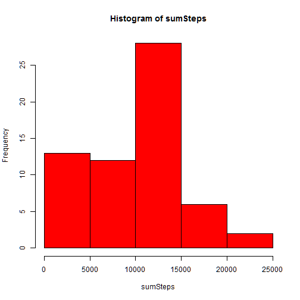
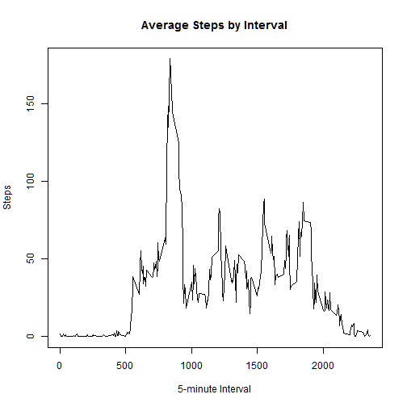
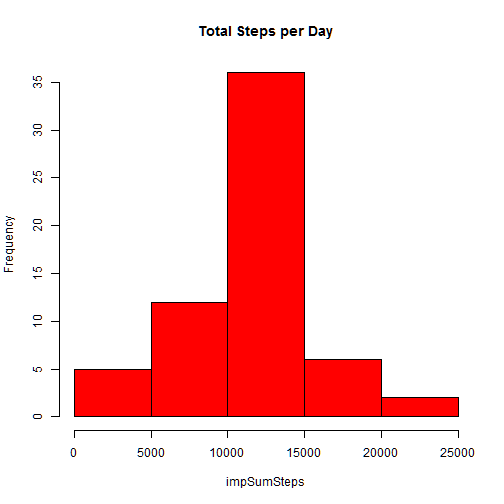
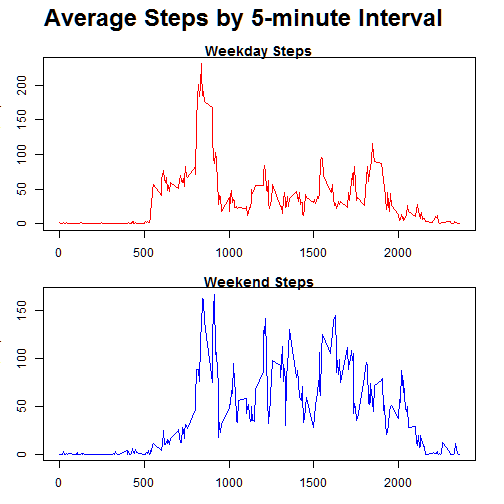

##Loading and preprocessing the data

Show any code that is needed to

1. Load the data (i.e. read.csv())

```r
setwd("~/R/RepRe")
dirtData <- read.csv('activity.csv')
actData <-dirtData
actData$steps[is.na(dirtData$steps)]<-0
```

##What is mean total number of steps taken per day?

Calculate the total number of steps taken per day

```r
sumSteps <- tapply(actData$steps, actData$date, sum)
mean(sumSteps)
```

```
## [1] 9354.23
```

Make a histogram of the total number of steps taken each day

```r
hist(sumSteps, col='red')
```

 

Calculate and report the mean and median of the total number of steps taken per day

```r
median(sumSteps)
```

```
## [1] 10395
```

```r
mean(sumSteps)
```

```
## [1] 9354.23
```


##What is the average daily activity pattern?

Make a time series plot (i.e. type = "l") of the 5-minute interval (x-axis) and the average number of steps taken, averaged across all days (y-axis)

```r
dataInt <- as.data.frame(tapply(actData$steps, actData$interval, mean))
colnames(dataInt) <- "steps"
dataInt$Interval <- row.names(dataInt)
plot(dataInt$Interval, dataInt$steps, type="l", main="Average Steps by Interval", xlab="5-minute Interval", ylab="Steps")
```

 

Which 5-minute interval, on average across all the days in the dataset, contains the maximum number of steps?

```r
subset(dataInt, Interval == max(dataInt$Interval))
```

```
##        steps Interval
## 955 18.29508      955
```

##Imputing missing values
Calculate and report the total number of missing values in the dataset (i.e. the total number of rows with NAs)

```r
nrow(dirtData[!complete.cases(dirtData$steps),])
```

```
## [1] 2304
```

Devise a strategy for filling in all of the missing values in the dataset. The strategy does not need to be sophisticated. For example, you could use the mean/median for that day, or the mean for that 5-minute interval, etc.

*Imputation is done with a regression using factor variables based on the 5-minute interval of the day. Missing values are imputed using the predicted values of this regression*

Create a new dataset that is equal to the original dataset but with the missing data filled in.


```r
missingReg <- lm(data=dirtData, steps ~ factor(interval))
impData <- dirtData
impData$predictSteps <- predict(missingReg, dirtData)
impData$steps[is.na(impData$steps)]<-impData$predictSteps[is.na(impData$steps)]
```


Make a histogram of the total number of steps taken each day 

```r
impSumSteps <- tapply(impData$steps, impData$date, sum)
hist(impSumSteps, col='red', main="Total Steps per Day")
```

 

Calculate and report the mean and median total number of steps taken per day.

```r
mean(impSumSteps)
```

```
## [1] 10766.19
```

```r
median(impSumSteps)
```

```
## [1] 10766.19
```

Do these values differ from the estimates from the first part of the assignment? What is the impact of imputing missing data on the estimates of the total daily number of steps?
*The values do differ. Interestingly, the mean and media are now equivalent. This suggests that the distribution is improved since median and mean equivalence suggests a normal distribution.*


##Are there differences in activity patterns between weekdays and weekends?

For this part the weekdays() function may be of some help here. Use the dataset with the filled-in missing values for this part.

Create a new factor variable in the dataset with two levels - "weekday" and "weekend" indicating whether a given date is a weekday or weekend day.

```r
impData$date <- as.Date(impData$date, format="%Y-%m-%d")

impData$weekday <- weekdays(impData$date)

impData$weekend <- 0
impData$weekend[grepl("Sunday",impData$weekday)] <- 1
impData$weekend[grepl("Saturday",impData$weekday)] <- 1

weekInt <- subset(impData, impData$weekend==0)
endInt <- subset(impData, impData$weekend==1)
```

Make a panel plot containing a time series plot (i.e. type = "l") of the 5-minute interval (x-axis) and the average number of steps taken, averaged across all weekday days or weekend days (y-axis).


```r
weekmean <- as.data.frame(tapply(weekInt$steps, weekInt$interval, mean))
colnames(weekmean) <- "steps"
weekmean$Interval <- row.names(weekmean)

endmean <- as.data.frame(tapply(endInt$steps, endInt$interval, mean))
colnames(endmean) <- "steps"
endmean$Interval <- row.names(endmean)

oldpar <- par(mfrow=c(2,1), mar=c(3,3,1,1), oma=c(0,0,3,1))  ## oma creates space 
plot(weekmean$Interval, weekmean$steps, type="l", col="red", main="Weekday Steps")
plot(endmean$Interval, endmean$steps, type="l", col="blue", main="Weekend Steps")
mtext("Average Steps by 5-minute Interval", side=3, line=1, outer=TRUE, cex=2, font=2)
```

 

```r
par(oldpar)
```
